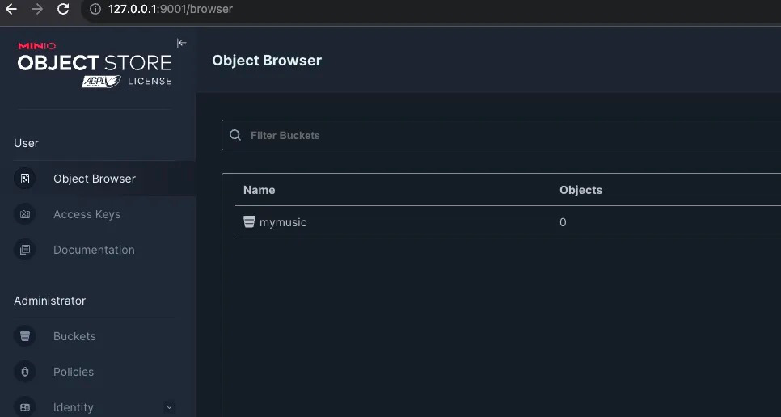

# minio

# 快速开始

## 1.docker 启动 minio server

```shell
docker run -d --name my-minio 
-p 9000:9000 
-p 9001:9001 minio/minio server /data --console-address ":9001"
```

参数解读：
- --console-address ":9001" ：指定 web 界面的端口是 9001

## 2.访问 minio 的 web 界面

通过 http://127.0.0.1:9001 访问

默认账号密码：

minioadmin

minioadmin



## 3.引入 minio sdk 库，调用 api 进行相关操作

库名：`github.com/minio/minio-go`

```go
package main

import (
	"fmt"
	"github.com/minio/minio-go"
	"log"
)

var (
	client *minio.Client
	err    error
)

func init() {
	client, err = minio.New(endpoint, accessKeyID, secretAccessKey, useSSL)
	if err != nil {
		log.Fatalln("minio连接错误: ", err)
	}
	log.Printf("%#v\n", client)
}

func main() {
	// 1.创建 bucket
	createBucket(BUCKET_NAME)

	// 2.列出所有 bucket
	listBucket()

	//dir, _ := os.Getwd()
	//fmt.Println("dir-->", dir)

	// 3.上传文件到 bucket
	FileUploader(BUCKET_NAME, "图片.jpeg", "./minio/source/图片.jpeg", CONTEXT_TYPE_TEXT)

	// 4.从 bucket 下载文件
	FileGet(BUCKET_NAME, "图片.jpeg", "./minio/download/图片.jpeg")
}
```

# 参考文档

- [Minio官方中文文档](https://www.minio.org.cn/docs/minio/container/index.html)
- [Minio快速入门](https://juejin.cn/post/7001676085087698974)